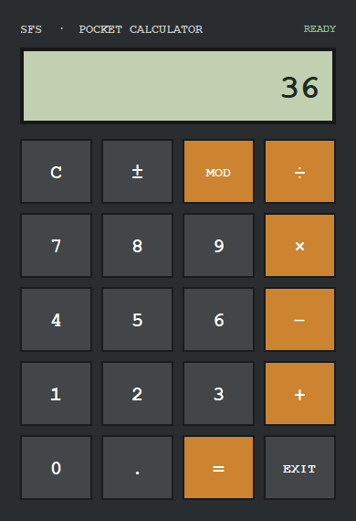

# Ma Calculette · Restored Edition

  

A small calculator created in 2021, restored without losing its simple desktop spirit. It performs the five original operations and now has reliable decimal handling, keyboard controls and autonomous packages.



## Run it

Download your system archive from the **[latest release](https://github.com/sofoste93/Calculette/releases/latest)**, extract it and launch `Calculette`. Java is already included.

Developers can run it directly:

```bash
git clone https://github.com/sofoste93/Calculette.git
cd Calculette
mvn test
mvn package
java -jar target/Calculette.jar
```

## Controls

- `+`, `−`, `×`, `÷` and `MOD` perform the original operations.
- Enter calculates; Escape clears; Backspace removes the last digit.
- The mouse buttons remain the simplest way to use everything.

## Learn from the project

The code intentionally contains only two production classes:

- `CalculatorEngine` owns numbers and arithmetic. It has no user-interface code.
- `CalculetteApp` builds the Swing window and translates clicks or keys into engine calls.

Start with `CalculatorEngine.inputDigit`, follow `chooseOperator`, then read `evaluate`. The tests repeat the same steps and show how separating logic from the interface makes a graphical app easy to verify.

## Restored, not reinvented

- replaced the obsolete bundled JavaFX JAR with standard Swing
- corrected package structure and introduced a reproducible Maven build
- fixed division by zero, repeated decimals and empty-state errors
- retained the compact grey calculator style with a small warm accent
- added a real screenshot, focused comments, tests and release checksums

The original `Moon.jpg` remains in the repository as a souvenir from the first design experiments.

Created by [Stephane Sob Fouodji](https://github.com/sofoste93).
